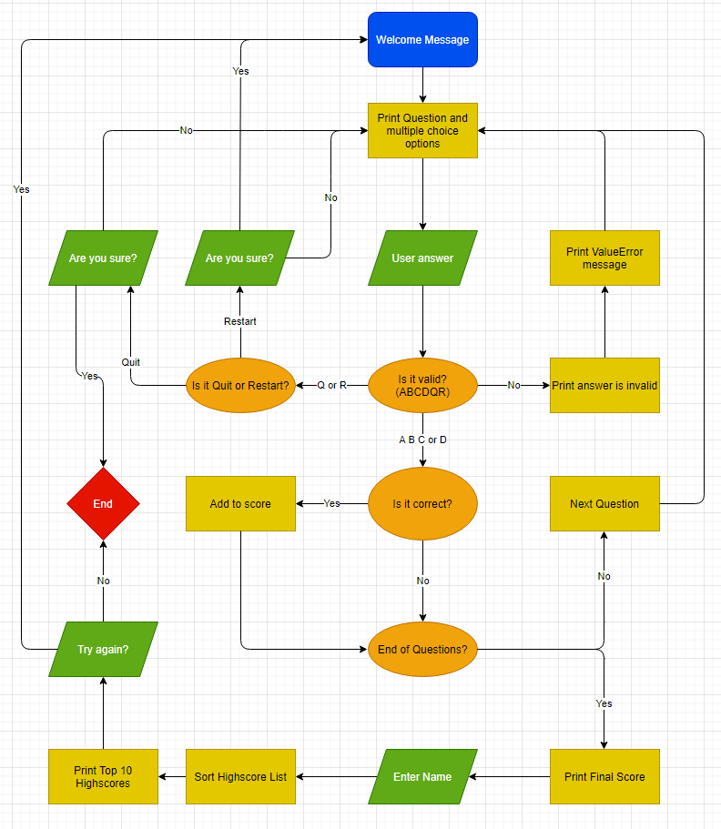
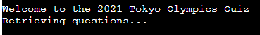
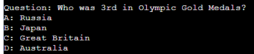
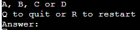
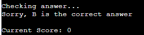
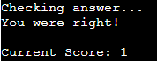
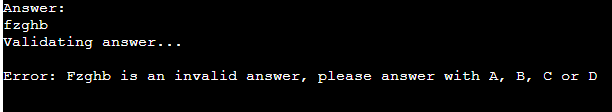
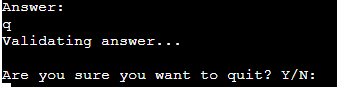
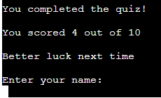
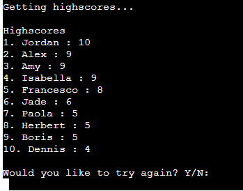

# The Tokyo Olympics Quiz
The Tokyo Olympics Quiz is a Python terminal quiz, which runs in the Code Institute mock terminal on Heroku.

Users answer 10 multiple choice questions about the Tokyo 2021 Olympic Games and are then ranked in a Highscores list.

The live app can be found [here](https://tokyo-olympics-quiz.herokuapp.com/)

___

## User Experience

### User stories

As a user I would like to be able to...

* Record my score
* Compare my score to previous attempts
* Be told if I answered correctly after each question
* Quit or restart at any time
* Try again at the end of the quiz
### App Owner Stories
As the app owner I would like to...

* Disply the questions and multiple-choice options clearly
* Store all questions, answers and highscores in easy yo deal with sheets
* Tell the user when invalid inputs have been entered
* Tell the user which inputs are valid and how to quit and restart
* Ask the user "Are you sure?" to prevent unwanted quit or restart

___

## Flowchart

___

## Features

### Existing Features

* Welcome message

    * To welcome the user and provide the name for the app
    * A "retrieving questions..." message to ensure the user that the app is loading up

    

* Question and options layout
    * Easy to read layout of Question and mutiple choice options underneath
    * Current Score

    

* Input instructions

    * Instructions to tell the user how to provide a valid input
    * Instrcutions on how to quit and restart

    

* Input Response

    * Instant feedback on answer
    * Current score counter

    

    

    * Error message for invalid inputs

    

    * "Are you sure?" message to prevent the user from doing an unwanted quit or restart
    * Also accepts whole words as user inputs ("yes", "no", "quit", "restart")

    

* After quiz

    * Final Score out of 10
    * Appropraite message based on performance
    * User can enter their name

    

    * Top 10 Highscores listed
    * Try again option

    

### Google Spreadsheet

* Questions and mutiple choice options
* Correct Answers
* Highscores

### Future Features

* A start input
* Allow user to access Highscores at the start of the quiz
* Tell user what place they came in

___

## Testing

I tested this app by:

* Passing the code through [PEP8](http://pep8online.com/) and confirmed no mistakes
* Giving invalid inputs to test expected error messages
* Testing in my local terminal and the Code Institute Heroku terminal

___

## Bugs and Solutions

* Lambda function
* Trim answers and capitalize answers
* Whole word input
* validate return false
* highscore list length

___

## Deployment

This project was deplyed using Code INstitue's mock terminal for Heroku

Steps for deploement:

* Fork or clone this repository
* Create a new Heroku app
* Set the buildback to **Python** and **NodJS** in that order
* Link th eHeroku app to the repository
* Click on **Deploy**

___

## API

___

## Credits

* Code institute for the deployment terminal
* Wikipedia for information about the Tokyo 2021 Olympic Games

