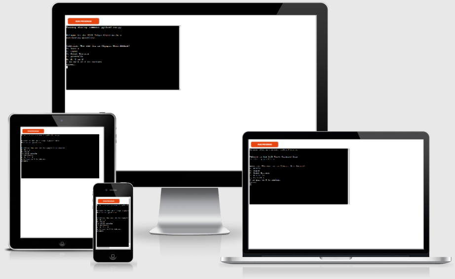

# The Tokyo Olympics Quiz
The Tokyo Olympics Quiz is a Python terminal quiz, which runs in the Code Institute mock terminal on Heroku.

Users answer 10 multiple choice questions about the Tokyo 2021 Olympic Games and are then ranked in a Highscores list.

The live app can be found [here](https://tokyo-olympics-quiz.herokuapp.com/)

## User Experience

### User stories

*
*
### App Owner Stories
*
*

## Functional Scope

flowchart

## Features

### Existing Features

Welcome message

Question and options layout

Input instructions

### Future Features

*
*

## Testing

* PEP8
* Given invaid inputs
* local terminal

## Bugs and Solutions

* Lambda function

## Deployment

## API

## Credits
